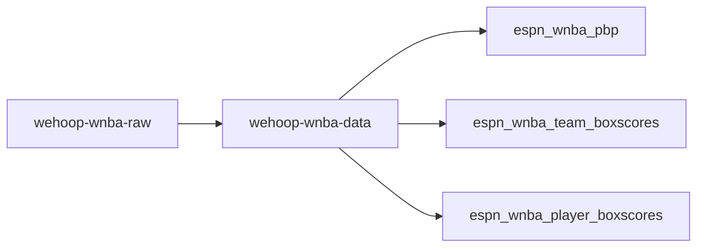
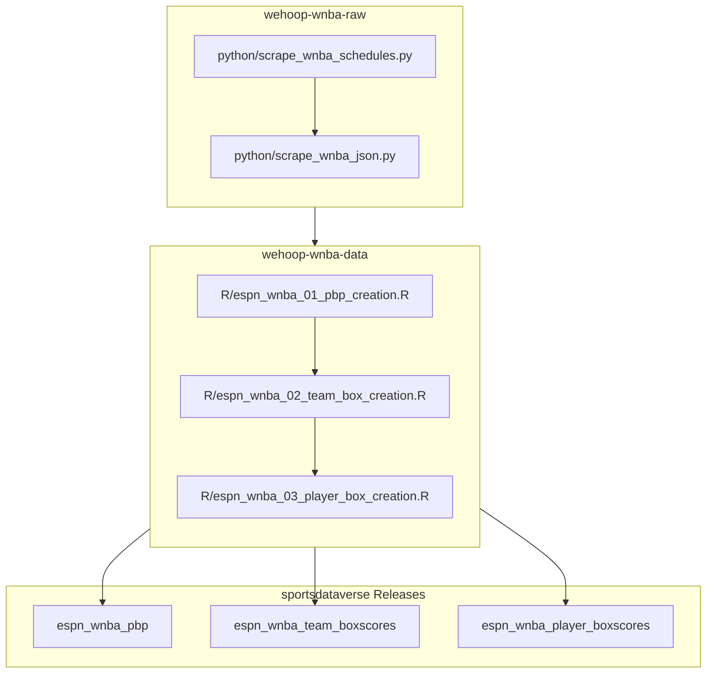

# wehoop-wnba-raw

## Fork Onboarding Notes

This fork is used as the local raw-data source for `WNBA-Stats-Exploration`. The upstream repository is public, but this fork may carry local scraper fixes and current-season refresh output that are not intended to merge back upstream.

Day-to-day responsibilities in this repo:

- Refresh ESPN schedule and raw/final game JSON.
- Refresh auxiliary ESPN feeds when roster, standings, officials, or season-stat tables need to move forward.
- Keep generated files under `wnba/` available for the DB sync in `WNBA-Stats-Exploration`.

The compact SQLite database is not built here. After scraping, switch to `WNBA-Stats-Exploration` and run `sync-wnba-raw` there.

## Local Setup

This checkout is expected to use `uv`:

```powershell
cd <path-to-wehoop-wnba-raw>
uv sync
```

Most scraper commands should be run with `--native-tls` on this Windows machine:

```powershell
uv run --native-tls python python/scrape_wnba_schedules.py -s 2026 -e 2026
uv run --native-tls python python/scrape_wnba_json.py -s 2026 -e 2026
```

If a command exits cleanly but a completed game is still missing, compare ESPN schedule completion in the DB repo against this repo's schedule parquet. ESPN can expose PBP before the local raw schedule marks a game completed. In that case, a targeted one-game scrape may be needed before the DB incremental sync.

## Current-Season Refresh

For game data only:

```powershell
uv run --native-tls python python/scrape_wnba_schedules.py -s 2026 -e 2026
uv run --native-tls python python/scrape_wnba_json.py -s 2026 -e 2026
```

For auxiliary data:

```powershell
uv run --native-tls python python/scrape_wnba_officials.py -s 2026 -e 2026
uv run --native-tls python python/scrape_wnba_game_rosters.py -s 2026 -e 2026
uv run --native-tls python python/scrape_wnba_standings.py -s 2026 -e 2026 --force
uv run --native-tls python python/scrape_wnba_team_rosters.py -s 2026 -e 2026 -r true
uv run --native-tls python python/scrape_wnba_team_stats.py -s 2026 -e 2026 --force
uv run --native-tls python python/scrape_wnba_player_stats.py -s 2026 -e 2026 -r true
```

The game JSON scraper has an argparse boolean quirk around `-r`; omit it for the normal pass unless you intentionally want to rescrape existing files.



## wehoop ESPN WNBA workflow diagram



## Women's Basketball Data Releases

[ESPN Women's College Basketball Schedules](https://github.com/sportsdataverse/sportsdataverse-data/releases/tag/espn_womens_college_basketball_schedules)

[ESPN Women's College Basketball PBP](https://github.com/sportsdataverse/sportsdataverse-data/releases/tag/espn_womens_college_basketball_pbp)

[ESPN Women's College Basketball Team Boxscores](https://github.com/sportsdataverse/sportsdataverse-data/releases/tag/espn_womens_college_basketball_team_boxscores)

[ESPN Women's College Basketball Player Boxscores](https://github.com/sportsdataverse/sportsdataverse-data/releases/tag/espn_womens_college_basketball_player_boxscores)

[ESPN WNBA Schedules](https://github.com/sportsdataverse/sportsdataverse-data/releases/tag/espn_wnba_schedules)

[ESPN WNBA PBP](https://github.com/sportsdataverse/sportsdataverse-data/releases/tag/espn_wnba_pbp)

[ESPN WNBA Team Boxscores](https://github.com/sportsdataverse/sportsdataverse-data/releases/tag/espn_wnba_team_boxscores)

[ESPN WNBA Player Boxscores](https://github.com/sportsdataverse/sportsdataverse-data/releases/tag/espn_wnba_player_boxscores)


## Data Repositories

[wehoop-wnba-raw data repository (source: ESPN)](https://github.com/sportsdataverse/wehoop-wnba-raw)

[wehoop-wnba-data repository (source: ESPN)](https://github.com/sportsdataverse/wehoop-wnba-data)

[wehoop-wnba-stats-data Repo (source: NBA Stats)](https://github.com/sportsdataverse/wehoop-wnba-stats-data)

[wehoop-wbb-raw data repository (source: ESPN)](https://github.com/sportsdataverse/wehoop-wbb-raw)

[wehoop-wbb-data repository (source: ESPN)](https://github.com/sportsdataverse/wehoop-wbb-data)
